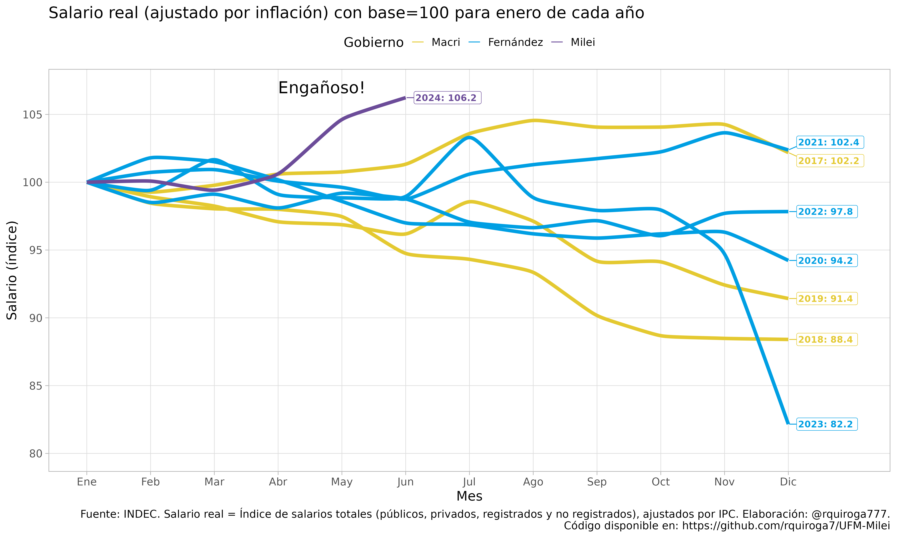

# Repositorio de análisis de salario real

Este repositorio contiene un análisis del salario real en Argentina, utilizando datos del INDEC. Se intentará mostrar que los gráficos generados por la "Milei Reform Watch" de la UFM, Universidad Francisco Marroquín (https://milei.ufm.edu/es/) son engañosos y pretenden deslindar al gobierno de Milei del empeoramiento de la inflación ocurrido en diciembre de 2023 producto de la devaluación efectuada por el gobierno de Milei el 13 de diciembre de 2023.

## Descripción del análisis

El análisis se basa en repetir los gráficos de la evolución de la inflación y del salario real que realizó la UFM, mostrar por qué son engañosos, y proveer una versión no engañosa de los mismos.

## Resultados

### Inflación mensual según INDEC

Este gráfico muestra la inflación mensual, pero en el gráfico asigna esa inflación al primer día de cada mes. Luego, grafica la fecha de asunción de Milei el día 10 de diciembre de 2023, lo cual parecería responsabilizar al gobierno anterior de la inflación de diciembre, lo cual es sumamente engañoso dado que en gran parte el aumento de la inflación en diciembre se debió a la devaluación decidida por Milei el 13 de diciembre .

Repetimos este gráfico con los datos INDEC:

Ahora, corregimos para mostrar que el dato de inflación de diciembre corresponde en gran medida al gobierno de Milei y no al gobierno anterior.

### Salario real con base 100 para enero de cada año

### Salario real con base 100 para noviembre del año anterior

## Fuente de los datos

Los datos utilizados en este análisis provienen del INDEC.

## Código disponible

El código utilizado para realizar este análisis está disponible en este repositorio.

## Contacto

Para más información, puede contactar con [rquiroga777](https://github.com/rquiroga7/UFM-Milei).
