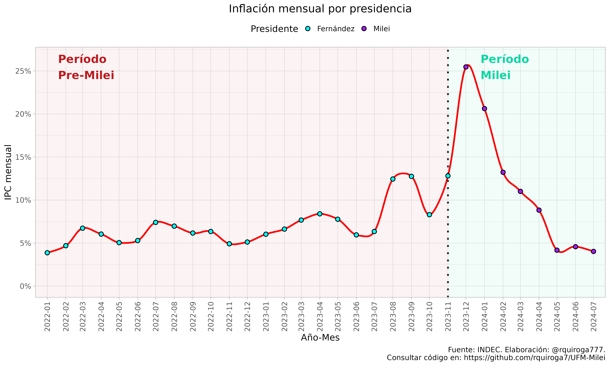
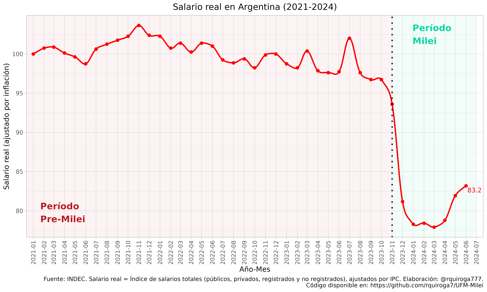
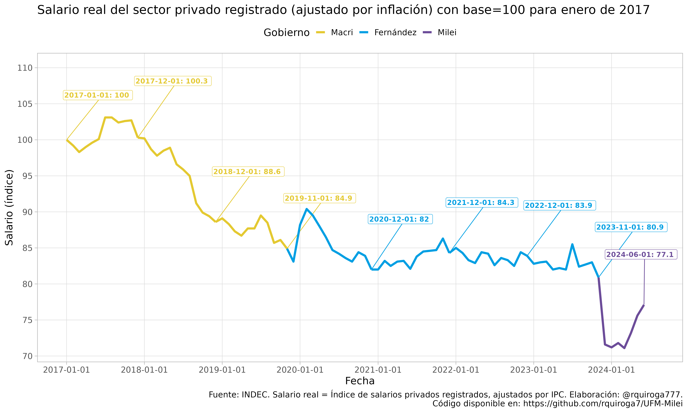
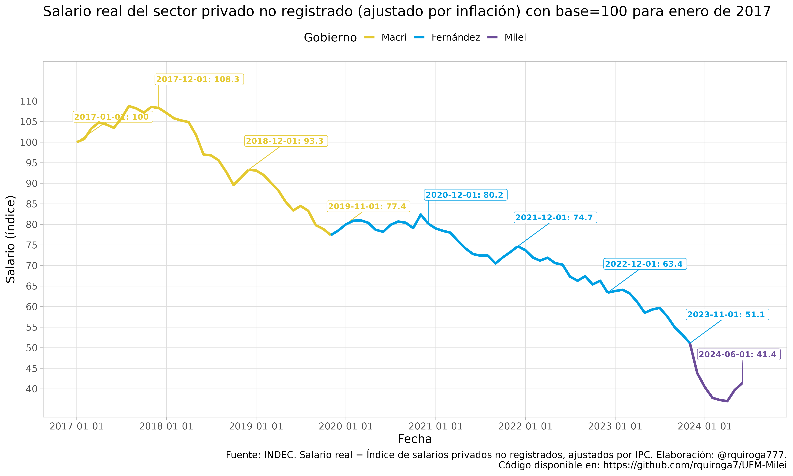
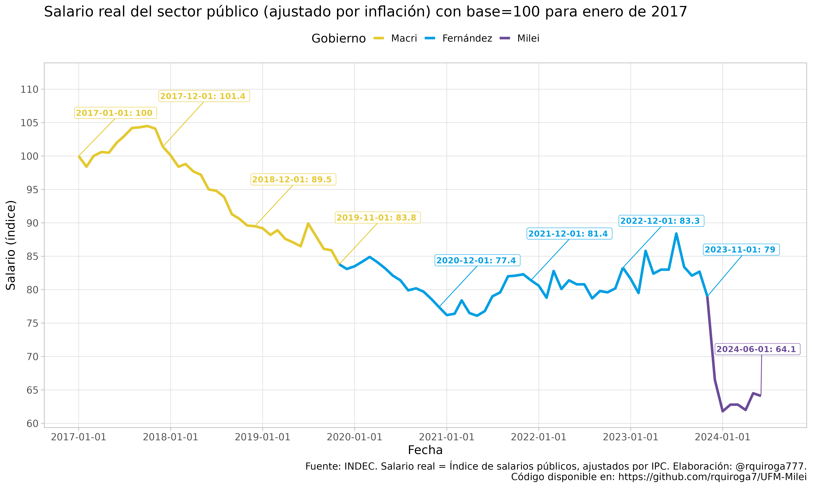

# Análisis de la variación de los salarios reales en la presidencia de Javier Milei en Argentina

Este repositorio contiene un análisis del salario real en Argentina, utilizando datos del INDEC. Se intentará mostrar que los gráficos generados por la "Milei Reform Watch" de la UFM, Universidad Francisco Marroquín (https://milei.ufm.edu/es/) son engañosos y pretenden deslindar al gobierno de Milei del empeoramiento de la inflación ocurrido en diciembre de 2023 producto de la devaluación efectuada por el gobierno de Milei el 13 de diciembre de 2023.

## Descripción del análisis

El análisis se basa en repetir los gráficos de la evolución de la inflación y del salario real que realizó la UFM, mostrar por qué son engañosos, y proveer una versión no engañosa de los mismos.

## Resultados

### Inflación mensual según INDEC

Vemos un gráfico engañoso de la UFM donde grafican inflación mensual, pero en el gráfico se grafica dicha inflación mensual en el primer día de cada mes. 

Luego, grafica la fecha de asunción de Milei el día 10 de diciembre de 2023, lo cual parecería responsabilizar al gobierno anterior de la inflación de diciembre, lo cual es sumamente engañoso dado que en gran parte el aumento de la inflación en diciembre se debió a la devaluación decidida por Milei el 13 de diciembre .

Repetimos este gráfico con los datos INDEC:

Ahora, corregimos la fecha de "cambio de gobierno". El panorama que muestra este gráfico es muy distinto del anterior. Queda claro que la pequeña mejora de los últimos meses ocurre luego de un gran salto inflacionario en diciembre, y los niveles de inflación de mayo y junio de 2024 son similares a los de principios de 2022.

### Salario real para el período 2021-2024

El gráfico engañoso de la UFM repite el mismo error de antes. Grafica la inflación que corresponde a todo el mes de diciembre el 01/12/2024.

Repetimos este gráfico engañoso con los datos INDEC, y coloreando cada línea anual de acuerdo a la presidencia correspondiente:

Ahora, corregimos la fecha de "cambio de gobierno", quedando más claro que la pequeña recomposición salarial observada en mayo y junio de 2024 es aún insuficiente para compensar la pérdida ocurrida en diciembre de 2023 tras la devaluación del peso argentino de más del 50% decidida por Milei.

### Salario real con base 100 para enero de cada año
Nuevamente, vemos un gráfico engañoso, donde se toma como base 100 el salario de enero de cada año. Esto desdibuja el efecto sobre los salarios reales del pico inflacionario que se produjo en diciembre como consecuencia de la devaluación del 13 de diciembre decidida por Milei para el año 2024, y genera un valor muy bajo de salarios para fines de 2023, que en realidad no es enteramente atribuible al gobierno anterior, sino en gran parte debido a la devaluación antes mencionada.

Repetimos este gráfico con datos INDEC:

Ahora realizamos un gráfico similar, pero tomando como base el mes de noviembre del año anterior. De esta manera, podemos evaluar la variación del salario real desde que asume Milei y comparar con años anteriores.

### Salario real promedio para el período 2017-2024

Por último, graficamos el indice de salario real (ajustado por inflación) desde 2017  para entender por qué la situación salarial actual es tan agobiante aunque parece haber un ligero repunte desde el mes de mayo. Vemos que se vienen sumando grandes caídas del salario real en los años 2018, 2019 y 2024, acumulado con las caídas menores de los años 2020, 2021 y 2023.

Al analizar los salarios reales de los trabajadores registrados del sector privado, vemos que es el único sector con recuperación significativa en los meses de mayo y junio de 2024, aunque aún no alcanza a compensar la pérdida de diciembre de 2023.

Al analizar los salarios reales de los trabajadores no registrados del sector privado, vemos que es el sector con mayor pérdida salarial en el período analizado, y hay poca recuperación en los meses de mayo y junio de 2024.

Al analizar los salarios reales de los trabajadores del sector público, vemos que la recuperación en los meses de mayo y junio de 2024 es casi nula.

En resumen, aunque en algunos sectores se observa una recuperación de los salarios para mayo y junio, no alcanza para compensar la pérdida de poder adquisitivo que produjo la devaluación decidida en diciembre de 2023 por el gobierno de Milei, mientras que en los sectores públicos y no registrados, el poder adquisitivo de los salarios está en una situación crítica, encontrándose en mínimos históricos para el período analizado.

## Fuente de los datos

Los datos utilizados en este análisis provienen del INDEC.

## Código disponible

El código utilizado para realizar este análisis está disponible en este repositorio.

## Contacto

Para más información, puede contactarse con @rquiroga777 en Twitter, o a través de este repositorio.
